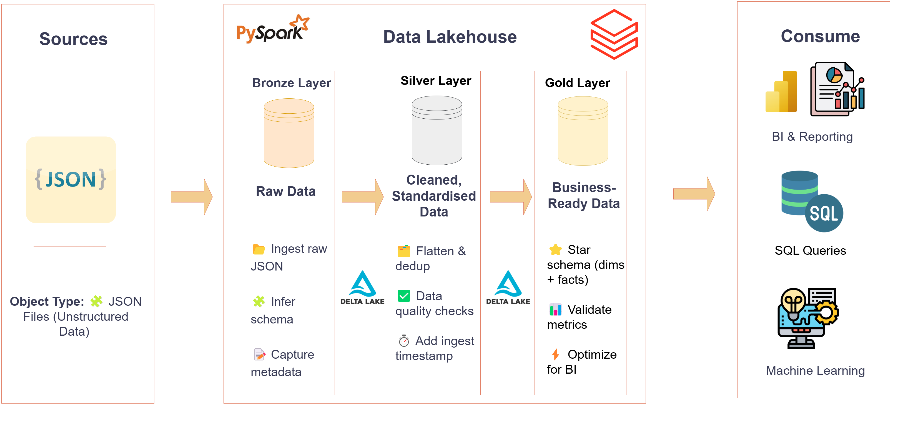

# 🌌 Lakehouse_Alchemy: Bronze_to_Gold_Pipeline


> **From raw JSON chaos to curated analytics — an end-to-end PySpark Lakehouse pipeline.**

---

## 🚀 Project Overview

**Lakehouse-Alchemy** is a robust and scalable data engineering project showcasing an **end-to-end ETL pipeline** built on the **Medallion Architecture** within a **Data Lakehouse**.

It leverages **PySpark Structured Streaming** to process unstructured JSON data through dynamic **Bronze, Silver, and Gold layers**, transforming raw data into analytics-ready tables for business insights.

🛠 Hosted on **Databricks**, this pipeline demonstrates modern data engineering practices with a focus on:

* Scalability ⚡
* Data Quality ✅
* Performance Optimization 🚀

---

## ✨ Key Features

* 🟤 **Dynamic Bronze Layer**: Ingests raw JSON with inferred schemas, capturing metadata for flexible handling of unstructured data.
* ⚪ **Silver Layer**: Flattens nested structures, deduplicates records, and ensures data quality.
* 🟡 **Gold Layer**: Creates analytics-ready **dimension** and **fact tables** optimized for reporting.
* 🏗️ **Medallion Architecture**: Organizes data into **Bronze (raw)**, **Silver (cleaned)**, **Gold (curated)**.
* 🔄 **Structured Streaming**: Supports batch and continuous processing with fault tolerance.
* 💾 **Delta Lake**: Provides ACID transactions, schema enforcement, and time travel.
* 🔍 **Data Quality Checks**: Filtering, deduplication, and validation at each stage.

---

## 🏗️ Architecture

The pipeline follows the **Medallion Architecture**:



### Bronze Layer (`bronze_ingestion.py`)

* Ingests raw JSON from `/Volumes/pyspark_dwh/source/source_data`.
* Wraps data into `payload` struct with **file path + ingestion timestamp**.
* Streams into `pyspark_dwh.bronze` Delta tables.

### Silver Layer (`silver_transformation.py`)

* Flattens nested structs and arrays.
* Deduplicates by **entity-specific primary keys**.
* Adds `silver_ingest_ts`.
* Streams into `pyspark_dwh.silver`.

### Gold Layer (`golden_transformation.py`)

* Builds **star schema**:

  * `dim_customers` 🧑‍🤝‍🧑
  * `dim_products` 📦
  * `fact_sales` 💰
* Validates data (non-null IDs, positive quantities/prices).
* Optimized with **ZORDER**.

---

## ⚙️ Technologies Used

* 🐍 **Python**, **PySpark**, **SparkSQL**
* 🔄 **PySpark Structured Streaming**
* 💾 **Delta Lake**
* ☁️ **Databricks**
* 📂 **Git/GitHub**
* 📝 **Jupyter Notebooks**
* 🎨 **Draw\.io** for diagrams

---

## 📂 Project Structure

```
Lakehouse-Alchemy-Bronze-to-Gold-Pipeline/
├── bronze_ingestion.py      # Ingest raw JSON → Bronze
├── silver_transformation.py # Flatten & clean → Silver
├── golden_transformation.py # Star schema tables → Gold
├── diagrams/                # Architecture diagrams
├── requirements.txt         # Project dependencies
├── LICENSE                  # MIT License
└── README.md                # Documentation
```

---

## 📊 Use Cases

* 📈 **Real-Time Analytics**: Dashboards in Power BI/Tableau.
* 🏢 **Data Warehousing**: Build scalable Lakehouse.
* ✅ **Data Quality**: Deduplication & validation.
* ⚡ **Scalability**: Handle massive JSON datasets.

---

## 🎯 Future Enhancements

* ⏱️ Continuous streaming triggers (`processingTime = '1 minute'`).
* 📊 Direct integration with Tableau/Power BI.
* 🔔 Monitoring & alerting for pipeline failures.
* ✅ Data observability with **Great Expectations**.
* ⚙️ CI/CD automation using **GitHub Actions**.

---

## 📚 Learn More

* [Delta Lake Documentation](https://docs.delta.io)
* [PySpark Structured Streaming Guide](https://spark.apache.org/docs/latest/structured-streaming-programming-guide.html)
* [Medallion Architecture](https://www.databricks.com/glossary/medallion-architecture)

---

## 📬 Contact

* **Author**: Sergi Tkeshelashvili
* 📂 **Repository**: [Lakehouse-Alchemy-Bronze-to-Gold-Pipeline](https://github.com/sergitkeshelashvili/Lakehouse-Alchemy-Bronze-to-Gold-Pipeline)
* 💼 LinkedIn: [https://www.linkedin.com/in/sergi-tkeshelashvili-022011383](https://www.linkedin.com/in/sergi-tkeshelashvili-022011383)

---

## 🛡️ License  

Licensed under the **MIT License**.  

---

✨ *Turn raw data into business gold with Lakehouse-Alchemy!* ✨

